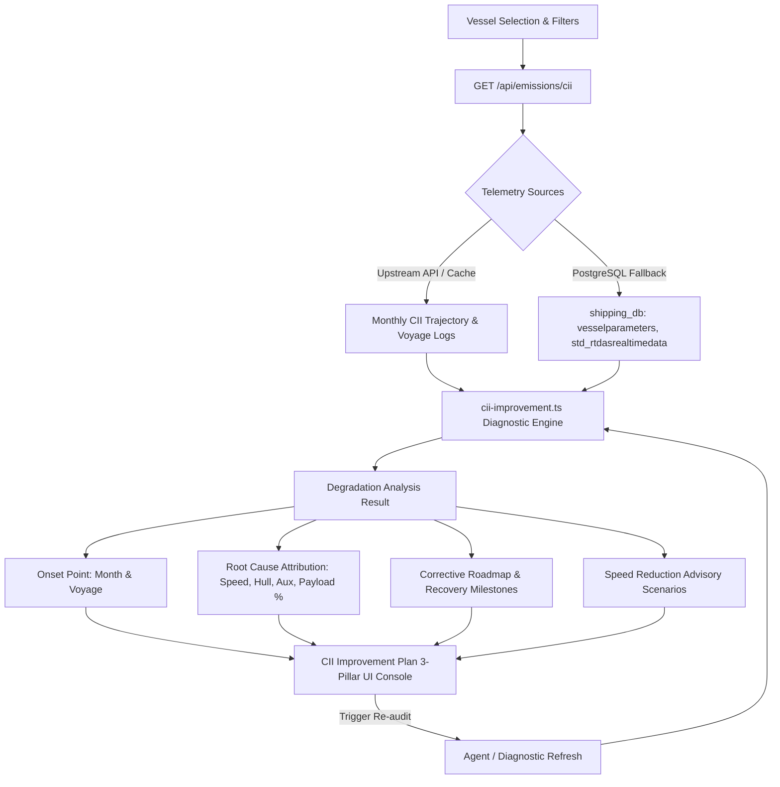

# CII Improvement Plan & Degradation Diagnostic Specification

- **Date**: 2026-09-08
- **Status**: Approved for Implementation
- **Target Route**: `app/pages/emissions.vue`
- **Target Backend**: `server/api/emissions/cii.get.ts`, `server/utils/marine/cii-improvement.ts`

---

## 1. Overview & Business Goal

Vessel operators and superintendents need an automated, non-chat **CII Improvement Plan** module directly inside the Emissions Dashboard. Rather than requiring users to manually converse with a chatbot, the widget automatically detects and displays:
1. **When degradation started**: Pinpoints the exact historical month/voyage where attained CII deteriorated past regulatory or company benchmarks.
2. **Why degradation started**: Analyzes telemetry, engine data, and fuel records to break down the primary driving factors (e.g., speed profile excursions, hull biofouling/resistance, excessive port/auxiliary fuel burn, or transport work shortfalls).
3. **Actionable Improvement Plan**: Formulates a prioritized corrective roadmap with turnaround targets.
4. **Integrated Speed Reduction Advisory**: Embeds the interactive hydrodynamic speed trim simulator directly into the plan so operators can immediately test speed reduction levers and commit to corrective scenarios.

---

## 2. Architecture & Data Flow



---

## 3. Detailed Component & UI Design

The widget replaces the standalone 5-column `Speed Reduction Advisory` card and becomes a full-width (`lg:col-span-12`), 3-pillar executive diagnostic console titled **"CII Improvement Plan & Root-Cause Diagnosis"**.

### Pillar 1: Degradation Intelligence & Onset Timeline (4 Columns)
- **Status Badge & Onset Callout**:
  - Highlights whether degradation is active or if the vessel is in a compliant operating band.
  - Displays: `Degradation Onset: <Month> <Year> (Voyage <Number>)`.
  - Severity indicator based on current grade (`Grade D` / `Grade E`).
- **Onset Delta Metrics**:
  - Attained CII drift since onset point (e.g., `+0.72 gCO₂/(MT·NM)`).
  - Rating degradation jump (e.g., `Grade C → Grade D`).
- **Root-Cause Attribution Matrix**:
  - Normalized percentage breakdown with visual progress bars:
    - **Speed Excursions**: Operational transits above eco-speed rating.
    - **Hull & Propeller Fouling**: Increased resistance / power penalty.
    - **Auxiliary & Boiler Load**: High port idle fuel consumption.
    - **Payload / Ballast Shortfall**: Unfavorable cargo deadweight utilization.
- **Diagnostic Executive Summary**:
  - Concise bullet point explaining *why* the degradation occurred (e.g., *"Elevated main engine speed between Gibraltar and Suez, coupled with an estimated 8.4% hydrodynamic resistance increase post-drydock"*).

### Pillar 2: Interactive Speed Reduction Advisory (4 Columns)
- **Speed Trim Selector**:
  - Interactive scenario pills: `-5%`, `-10%`, `-15%`, `-20%`, `-25%`.
- **Projected Turnaround**:
  - Attained Rating vs. Projected Rating badge (e.g., `Rating D` → `Rating C`).
  - Projected Attained CII tabular metric.
- **Quantified Hydrodynamic Benefits**:
  - Avoided CO₂ emissions (Metric Tons).
  - Estimated fuel cost reduction (EUR/USD).
  - Propulsion power reduction factor.
- **Reactive Coupling**:
  - Selecting a scenario instantly recalculates Pillar 3's projected recovery timeline.

### Pillar 3: Corrective Action Plan & Recovery Roadmap (4 Columns)
- **Prioritized Action Plan**:
  - **Immediate (Voyage-level)**: Instruct master and charterer to trim transit speed by selected percentage (e.g., `-10%` to `12.6 kts`).
  - **Short-Term (Port-level)**: Schedule diver hull & propeller inspection/cleaning at next port call.
  - **Medium-Term (Operational)**: Shift boiler loads to economizer during sea passages and minimize boiler idling during port congestion.
- **Recovery Roadmap & Milestone**:
  - Projected turnaround date (e.g., *"Restores Grade C compliance within 42 days (approx. 1.5 voyage cycles)"*).
- **Controls & Actions**:
  - **"Re-run AI Audit"** button with spinning loader and last-audited timestamp.
  - **"Copy Improvement Plan"** button for easy dispatch to vessel operators or superintendents.

---

## 4. Backend Diagnostic Model (`cii-improvement.ts`)

A new domain utility `server/utils/marine/cii-improvement.ts` defines the diagnosis contracts and calculation logic:

```typescript
export interface DegradationDriver {
  key: 'speed' | 'hull' | 'auxiliary' | 'payload'
  label: string
  percentage: number
  description: string
  icon: string
}

export interface CiiImprovementPlan {
  hasDegraded: boolean
  onset: {
    month: string
    voyageNumber: string
    initialRating: string
    currentRating: string
    ciiIncrease: number
  }
  drivers: DegradationDriver[]
  summary: string
  actionItems: Array<{
    phase: 'Immediate' | 'Short-Term' | 'Strategic'
    title: string
    description: string
    impact: string
    status: 'pending' | 'in_progress' | 'recommended'
  }>
  recoveryTarget: {
    targetRating: string
    projectedDays: number
    targetCii: number
  }
  lastAuditedAt: string
}
```

### Deterministic & Fallback Logic
1. **Scan `monthlyTrend`**: Detect the first month where rolling CII exceeded `requiredCII` or dropped in grade.
2. **Calculate Drivers**:
   - Compare propulsion vs. auxiliary fuel ratios.
   - Estimate hull resistance increase from speed vs. consumption exponent delta.
   - Evaluate transport work density ($CO_2 / (DWT \times Distance)$).
3. **Database Fallback**: When granular sensor records are present in PostgreSQL (`std_rtdasrealtimedata`), incorporate speed over ground (SOG) vs. speed through water (STW) slip factor.

---

## 5. Verification & Testing Plan

1. **Unit Tests (`tests/cii-improvement.test.ts`)**:
   - Verify onset detection accurately spots the month and voyage of degradation.
   - Verify driver percentage attribution sums to 100%.
   - Verify speed reduction selection synchronizes with recovery targets.
   - Verify graceful handling when a vessel is fully compliant (Grade A/B without degradation).
2. **Regression Testing**:
   - Run all existing test suites (`npm test`) to ensure existing CII calculations, Copilot agent tools, and multi-tenant routing remain 100% intact.
3. **Visual & User Experience Verification**:
   - Verify responsive design at desktop and tablet resolutions.
   - Verify seamless interaction when switching speed buttons.
