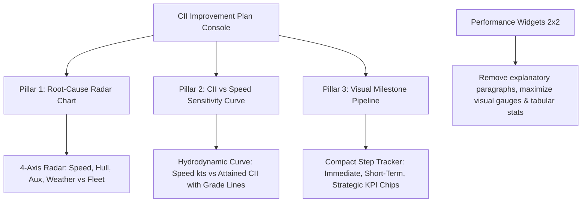

# CII Visual Charts & KPI Visualizer Specification

- **Date**: 2026-09-08
- **Status**: Approved for Implementation
- **Target Components**:
  - `app/components/emissions/CiiImprovementPlanCard.vue`
  - `app/components/emissions/widgets/WeatherImpactCard.vue`
  - `app/components/emissions/widgets/HullPropulsionCard.vue`
  - `app/components/emissions/widgets/EngineSfocCard.vue`
  - `app/components/emissions/widgets/OperationalProfileCard.vue`

---

## 1. Problem & Goal

The Emissions Dashboard currently contains too many descriptive text paragraphs and lists in the CII Improvement Plan and Performance widgets. Maritime operators and superintendents need visual instruments (charts, curves, radar diagrams, milestone trackers) to digest trends and threshold margins instantly without reading text.

---

## 2. Visual Architecture

---

## 3. Detailed Component Designs

### 3.1 Pillar 1: Root-Cause Radar Chart (`CiiImprovementPlanCard.vue`)
- **Replaces**: Text lists and descriptions of degradation drivers.
- **ECharts Radar Configuration**:
  - Indicators:
    - `Operational Speed` (max: 100)
    - `Hull Resistance` (max: 100)
    - `Port / Aux Load` (max: 100)
    - `Weather Penalty` (max: 100)
  - Series 1: `Vessel Current` (filled polygon with primary accent color and 0.25 opacity).
  - Series 2: `Fleet Baseline` (dashed neutral line for benchmark comparison).
- **Header Callout**: Single-line badge: `⚠️ Onset: <Month> (Voyage <Number>) • +<Delta> gCO₂/tnm`.
- **Zero paragraph text**.

### 3.2 Pillar 2: CII vs Speed Hydrodynamic Curve (`CiiImprovementPlanCard.vue`)
- **Replaces**: Descriptive text explaining cubic resistance law.
- **ECharts Line Curve**:
  - X-Axis: Speed in Knots (10.0 to 14.5 kts).
  - Y-Axis: Projected Attained CII.
  - Smooth spline curve representing cubic power/fuel relationship.
  - Horizontal reference lines (`markLine`):
    - Grade B boundary
    - Grade C (Required CII threshold)
    - Grade D boundary
  - Active Operating Point: Glowing pin marker at the currently selected speed trim.
- **Top Metric Strip**:
  - `-10% kts (12.6 kts)`
  - Avoided CO₂: `320.0 MT`
  - Power Factor: `72.9% load`

### 3.3 Pillar 3: Visual Action Milestone Pipeline (`CiiImprovementPlanCard.vue`)
- **Replaces**: Multi-line text descriptions in action items.
- **Milestone Steps**:
  - Horizontal step progression with status checkmarks and KPI chips:
    - Step 1: **Charter Speed Trim** (`-10% kts` | `-320 MT CO₂`)
    - Step 2: **In-Water Hull Cleaning** (`Propeller Polish` | `+8.5% Power`)
    - Step 3: **Auxiliary Boiler Shift** (`Economizer Shift` | `-2.4 MT Port Burn`)
  - Compliance Target Horizon:
    - Visual linear transition bar: `Grade D (6.2)` ➔ `Grade C (5.2)` with `~45 Days` badge.
  - Actions: **"Re-run AI Audit"** and **"Copy Plan"**.

### 3.4 Streamline 2x2 Performance Widgets
- Remove informative paragraphs and advisory footnotes from:
  - `WeatherImpactCard.vue`
  - `HullPropulsionCard.vue`
  - `EngineSfocCard.vue`
  - `OperationalProfileCard.vue`
- Keep high-contrast metric values, progress bars, and status badges.

---

## 4. Verification & Testing

- Run `npm test` to ensure all 35 tests continue to pass.
- Verify chart rendering in client and ensure SSR safety (`<ClientOnly>` wrappers with `<Skeleton>` fallbacks).
