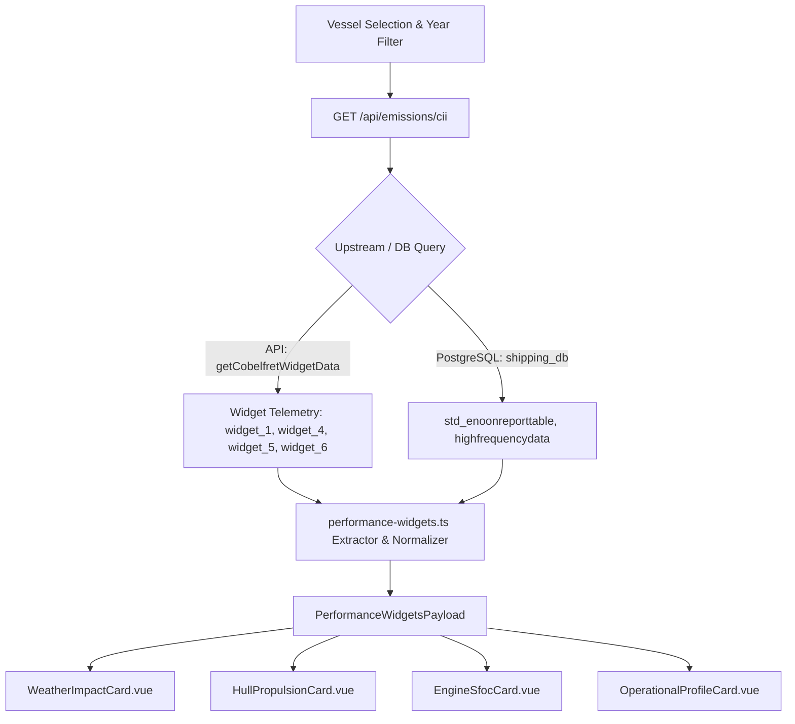

# Environmental & Technical Performance Widgets Specification

- **Date**: 2026-09-08
- **Status**: Approved for Implementation
- **Target Page**: `app/pages/emissions.vue`
- **Target Backend**: `server/api/emissions/cii.get.ts`, `server/utils/marine/performance-widgets.ts`
- **Target Components**:
  - `app/components/emissions/widgets/WeatherImpactCard.vue`
  - `app/components/emissions/widgets/HullPropulsionCard.vue`
  - `app/components/emissions/widgets/EngineSfocCard.vue`
  - `app/components/emissions/widgets/OperationalProfileCard.vue`

---

## 1. Overview & Operational Goals

To provide complete technical and environmental intelligence on the Emissions dashboard, we will implement 4 specialized performance widgets powered by upstream `getCobelfretWidgetData` and PostgreSQL `shipping_db`:
1. **Weather Impact & Regulatory Exclusion**: Evaluates adverse weather exposure, weather speed loss, and IMO MEPC.355(78) deduction eligibility.
2. **Hull Biofouling & Propulsion Monitor**: Tracks speed-power loss vs. sea trials, engine propeller slip, and clean hull drag penalty.
3. **Engine Health & SFOC Efficiency**: Displays Specific Fuel Oil Consumption (SFOC) vs. shop trial expected baselines and fleet averages.
4. **Operational Profile & Port Idle Energy Audit**: Quantifies voyage status breakdown (Laden, Ballast, Port, Anchorage) and auxiliary idle fuel penalties.

---

## 2. Architecture & Data Flow



---

## 3. Detailed Widget Specifications

### 3.1 Weather Impact & Regulatory Exclusion (`WeatherImpactCard.vue`)
- **Key Metrics**:
  - **Adverse Weather Days / %**: Extracted from `widget_4` (e.g. `32.9%` average bad weather days).
  - **Weather Speed Penalty**: Estimated speed loss (kts) due to adverse wind/waves.
  - **IMO MEPC.355(78) Exclusion Status**: Badge indicating whether fuel burned during severe weather qualify for regulatory CII correction deductions.
  - **Weather-Induced Fuel Penalty**: Quantified excess MT of CO₂ burned overcoming heavy sea conditions.

### 3.2 Hull Biofouling & Propulsion Monitor (`HullPropulsionCard.vue`)
- **Key Metrics**:
  - **Time Loss / Gain vs Sea Trial**: Extracted from `widget_6` (e.g. `-5.3% time loss`).
  - **Apparent Engine Slip**: Mean slip percentage from `shipping_db.std_enoonreporttable.Engine_Slip`.
  - **Hydrodynamic Resistance Gap**: Percentage power penalty attributed to hull/propeller biofouling.
  - **Cleaning Advisory Status**: `Recommended (Within 30 Days)` or `Clean (Optimal)`.

### 3.3 Engine Health & SFOC Efficiency (`EngineSfocCard.vue`)
- **Key Metrics**:
  - **Current SFOC**: Extracted from `widget_5` (e.g. `174.3 g/kWh`).
  - **Shop Trial Expected Baseline**: Expected SFOC (e.g. `168.0 g/kWh`).
  - **Fleet Average SFOC**: (e.g. `176.0 g/kWh`).
  - **Thermal & Combustion Efficiency**: Visual gauge comparing current value against min (150) and max (250) operational limits.
  - **SFOC Variance**: Green/amber delta showing efficiency deviation.

### 3.4 Operational Profile & Port Idle Energy Audit (`OperationalProfileCard.vue`)
- **Key Metrics**:
  - **Segmented Days & %**: Extracted from `widget_1` (Laden: `30.7%`, Ballast: `30.7%`, Port Operations: `15.2%`, Anchorage: `18.4%`, Maneuvering: `5.0%`).
  - **Segmented Bar / Donut Mini-Chart**: Visual colored distribution of voyage profile.
  - **Non-Productive Fuel Burn**: Auxiliary boiler and generator fuel consumed in port/anchorage without generating ton-miles.
  - **Ballast Payload Penalty**: Efficiency loss on unladen transits.

---

## 4. Backend Contracts (`performance-widgets.ts`)

```typescript
export interface WeatherImpactData {
  badWeatherPct: number
  averageBadWeatherDays: number
  shipsAffectedPct: number
  speedLossKnots: number
  excessCo2Mt: number
  imoExclusionEligible: boolean
}

export interface HullPropulsionData {
  timeLossPct: number
  engineSlipPct: number
  dragPenaltyPct: number
  cleaningStatus: 'optimal' | 'monitoring' | 'recommended' | 'critical'
  powerRecoveryPotentialPct: number
}

export interface EngineSfocData {
  currentSfoc: number
  expectedSfoc: number
  fleetAvgSfoc: number
  trendValue: number
  sfocDelta: number
  status: 'optimal' | 'normal' | 'elevated'
}

export interface OperationalProfileData {
  ladenPct: number
  ballastPct: number
  portPct: number
  anchoragePct: number
  maneuveringPct: number
  nonProductiveFuelMt: number
}

export interface PerformanceWidgetsPayload {
  weather: WeatherImpactData
  propulsion: HullPropulsionData
  engine: EngineSfocData
  operations: OperationalProfileData
}
```

---

## 5. Verification & Testing

- Unit tests in `tests/performance-widgets.test.ts` verifying telemetry parsing, fallbacks, and calculations.
- API regression testing verifying `performanceWidgets` payload in `/api/emissions/cii`.
- Full test suite passing with `npm test`.
